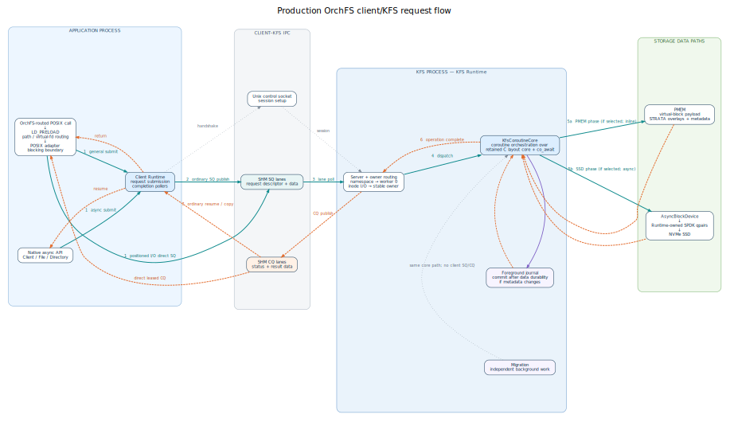

# C++20 coroutine and SPDK build/run guide

OrchFS now separates the public asynchronous API from the authoritative KFS
execution process:

- each LibFS process owns one `orchfs::async::Runtime` and submits filesystem
  requests through `Client`, `File`, and `Directory`;
- KFS owns a separate runtime and all authoritative filesystem state;
- coroutine handles and pointers never cross the process boundary; the IPC
  transport carries fixed wire descriptors and copied request metadata;
- on the production serving path, only KFS opens the NVMe controller through
  SPDK. LibFS has no SPDK qpair; the offline formatter is a separate exception;
- the existing POSIX/`LD_PRELOAD` surface is a blocking compatibility adapter
  over `Runtime::block_on()`, with a direct blocking session seam for
  positioned I/O.

## Architecture and request lifecycle



The diagram is generated from the checked-in
[Graphviz source](images/orchfs-async-request-flow.dot). Solid teal arrows show
request submission and selected data phases, dashed orange arrows show
completion and resume flow, purple arrows show a conditional journal commit,
and dotted gray arrows show session control or independent background work. It
describes the production client/KFS serving path. Offline `mkfs`, recovery and
device tests, and direct layered benchmarks do not traverse the complete
Client → SHM → Server → Core path.

### 1. Application entry and client ownership

`LibFS/orchfs_wrapper.c` retains the original application boundary. Pathname
operations select `/Or`; after `open`, descriptor operations route by the
OrchFS virtual descriptor rather than repeating pathname selection. A routed
call enters `LibFS/async_adapter.cpp`; native C++ code can instead call
`Client`, `File`, or `Directory` directly. The preload DSO constructor attempts
to initialize the adapter eagerly. A routed call reconnects lazily after an
initial failure or in a post-`fork()` child, while preserving the invariant of
one Runtime per process. A separate KFS process owns its own `Runtime` and all
authoritative filesystem state.

Only an external application thread may block at the POSIX compatibility
boundary. The adapter takes short lifecycle/slot leases, releases its
process-wide ownership gate before remote I/O, and then waits for the operation
without blocking a Runtime worker. General compatibility operations use
`Runtime::block_on()`. When a direct blocking lane is available, including the
default adapter configuration, positioned I/O publishes and waits from the
external caller thread instead. Native callers retain the `Task`/`JoinHandle`
interface and suspend.

### 2. Session setup and shared-memory transport

`Client::connect()` uses the Unix-domain control socket to create and monitor a
session. Steady-state requests do not send coroutine frames or raw pointers
through that socket. `Async/ipc_transport.cpp` carries fixed wire descriptors,
paths and request metadata, plus request/result payloads, through per-lane
shared-memory submission and completion rings. Large I/O is chunked to the
configured data-slot size.

The client Runtime polls the ordinary asynchronous completion lanes. A direct
blocking positioned-I/O caller instead drives its leased SQ/CQ lane from the
external thread. The KFS Runtime polls the matching submission lanes and
reserves a CQ slot before accepting work, so a request always has a place to
publish its result. The transported descriptor is the process boundary:
coroutine handles, C++ object addresses, and borrowed application-buffer
addresses remain local to their owner.

### 3. KFS dispatch and concurrency ownership

`Async/server.cpp` validates the wire request and resolves its remote handle.
Namespace operations enter worker 0; open-file data operations are reassigned
to the stable owner derived from the inode. Some handle lifecycle operations
also funnel through worker 0; handle lifetime/offset coordination and inode
range arbitration then protect the relevant state and overlapping ranges. The
server calls the injected `AsyncFilesystem`; production injects
`KfsCoroutineCore`, while tests may inject an in-memory implementation.

This ownership step is separate from the IPC lane. A client can use more lanes
than it has client Runtime workers, and a KFS request can move from its lane
owner to its inode owner before touching filesystem state.

### 4. Foreground heterogeneous data plan and durability

`Async/kfs_coroutine_core.cpp` is the authoritative coroutine orchestration
layer over the retained C on-media layout core (`kfs_core_api.c`,
`kfs_data_plan.c`, `lib_inode.c`, `lib_log.c`, `libspace.c`, and `migrate.c`).
It snapshots or updates mappings, acquires an inode-range permit, and builds
explicit PMEM and SSD phases:

- PMEM holds virtual-block payload, STRATA overlays, and persistent
  mapping/journal metadata;
- SSD reads and writes go through `AsyncBlockDevice`, which submits to the
  process-owned device service and suspends the coroutine;
- each configured SPDK qpair is owned and polled by one KFS Runtime worker;
  requests from any KFS worker map to one of those qpair owners, so callbacks
  resume work without a second service-thread pool;
- partial SSD overwrites use asynchronous read-modify-write when required, and
  independent device operations may be submitted as a batch.

The PMEM and SSD branches in the figure are phases selected by a foreground
file request's mapping and alignment plan; they are not both mandatory and the
figure does not assert that they always run concurrently. A successful
foreground write waits for every applicable phase: SSD I/O, if selected,
reaches the configured completion/FUA/flush durability point; changed PMEM data
or metadata is persisted on the worker that issued it; and a mapping or
inode-size transaction, if needed, commits only after the corresponding data is
durable. A stable overwrite that changes no mapping does not invent an empty
journal transaction. The server publishes success only after all phases
selected for that request have completed.

The migration scheduler independently calls `KfsCoroutineCore::migrate()` on
the same KFS Runtime, outside client SQ/CQ completion. It shares the core's
range arbitration, allocation, and device interfaces, but it has a separate
commit sequence. In the current tree, migration awaits device-write completion
before committing its mapping transaction; unlike the foreground write path,
it does not add an explicit `device_.flush()` when the selected policy is
`flush`. The foreground ordering above must therefore not be read as a
migration durability guarantee.

### 5. Completion and return

After an inline PMEM phase finishes or an SPDK callback makes a suspended core
graph runnable again, control returns from the core to the server lane owner,
which encodes status and result data into the reserved CQ slot. The client
Runtime poller matches an ordinary asynchronous response to its pending
request, and native callers resume their coroutine. A general POSIX call blocks
through `Runtime::block_on()`; the positioned-I/O fast path directly waits on a
leased CQ slot and copies any read payload from that slot on the external caller
thread.

The reverse path in the diagram is therefore a completion path, not a second
filesystem execution path: KFS remains the only owner of authoritative state
and, on the serving path, the only process that opens the NVMe controller.

### Relationship to the original OrchFS implementation

| Preserved contract or mechanism | Asynchronous production replacement |
| --- | --- |
| `/Or` routing and the documented POSIX/`LD_PRELOAD` subset | Blocking is confined to the external adapter boundary; internal APIs return coroutine tasks |
| Heterogeneous PMEM/SSD layout and alignment-based write partition | `KfsCoroutineCore` orchestrates the retained C layout core as suspendable PMEM, SSD, and journal phases |
| On-media mappings, allocator, journal, recovery, and migration | KFS Runtime ownership and range arbitration coordinate them without LibFS/KFS I/O pools |
| Cross-process client/KFS split | Fixed SHM SQ/CQ wire descriptors replace the legacy request/service-thread bridge |
| SSD data path | Production KFS uses Runtime-owned SPDK qpairs; LibFS never opens the controller |

The offline `mkfs` formatter remains a deliberate exception: it owns SPDK on
its calling thread and polls synchronously. A default non-SPDK build supplies
the async interfaces and hardware-independent tests, but does not build the
production KFS executable.

### Code map

| Stage | Primary implementation |
| --- | --- |
| POSIX interception and `/Or` routing | `LibFS/orchfs_wrapper.c` |
| Blocking compatibility, descriptor leases, client Runtime lifecycle | `LibFS/async_adapter.cpp` |
| Native proxy API and client completion polling | `Async/client.cpp`, `include/orchfs/async/client.hpp` |
| Control socket and SHM SQ/CQ transport | `Async/ipc_transport.cpp` |
| KFS lane polling, owner routing, remote handles, CQ publication | `Async/server.cpp` |
| Coroutine orchestration, range arbitration, PMEM/SSD plans, journal ordering | `Async/kfs_coroutine_core.cpp` |
| Retained on-media mapping, allocation, log, and migration mechanics | `LibFS/kfs_core_api.c`, `LibFS/kfs_data_plan.c`, `LibFS/lib_inode.c`, `LibFS/lib_log.c`, `LibFS/libspace.c`, `LibFS/migrate.c` |
| Coroutine-to-device suspension and batched completion | `Async/block_device.cpp` |
| KFS Runtime/server/migration lifecycle | `KernelFS/async_server_bridge.cpp` |
| SPDK qpair ownership and NVMe commands | `KernelFS/spdk_device_service.cpp`, `KernelFS/spdk_nvme_backend.cpp` |

The supported SPDK baseline is **v26.01**. Keep SPDK in a fixed external prefix
instead of copying its headers or libraries into this repository. The default
prefix is `/opt/orchfs/spdk`; override it only with an absolute `SPDK_ROOT` at
configure time. See the [official SPDK downloads](https://spdk.io/downloads/)
for release sources.

## Build without SPDK

The default build needs no SPDK installation. It builds the coroutine runtime,
IPC, client/server libraries, the POSIX/LD_PRELOAD adapter, a non-SPDK NVMe
bridge, and hardware-independent tests. It intentionally does not build KFS:

```bash
cmake -S . -B build-async \
  -DCMAKE_BUILD_TYPE=RelWithDebInfo \
  -DBUILD_TESTING=ON
cmake --build build-async -j"$(nproc)"
ctest --test-dir build-async --output-on-failure
```

`spdk_nvme_logic_test` is safe in this configuration. It validates request
splitting, alignment, read-modify-write planning, and the `ENOTSUP` fallback;
it does not open a controller.

The main CMake targets are:

| Target | Role |
| --- | --- |
| `orchfs_async_runtime` | C++20 `Task`, `JoinHandle`, scheduling, and range arbitration |
| `orchfs_async_ipc` | Unix control socket and shared-memory SQ/CQ transport |
| `orchfs_async_client` | LibFS-side asynchronous proxy API |
| `orchfs_async_server` | KFS-side authoritative request dispatcher |
| `orchfs_async_device` | Runtime-resuming asynchronous block-device phases |
| `orchfs_kfs_coroutine_core` | Runtime-native filesystem implementation behind `AsyncFilesystem` |
| `orchfs_spdk_backend` | SPDK NVMe backend, or an `ENOTSUP` stub when disabled |
| `OrchFS` | POSIX/LD_PRELOAD compatibility adapter backed by the async client |

The old LibFS/KFS service targets, NOASYNC mode, and `close_kfs` helper have
been removed. `kfs_main` and the standalone `mkfs` formatter are created only
when `ORCHFS_BUILD_KFS=ON`; that option force-enables SPDK.

## Build with SPDK v26.01

Build SPDK v26.01 and its DPDK submodule in the fixed prefix. CMake requires the
SPDK-generated metadata below that prefix, normally under
`build/lib/pkgconfig`; it deliberately does not select an unrelated system
`spdk_*.pc` file.

```bash
cmake -S . -B build-spdk \
  -DCMAKE_BUILD_TYPE=RelWithDebInfo \
  -DBUILD_TESTING=ON \
  -DORCHFS_BUILD_KFS=ON \
  -DSPDK_ROOT=/opt/orchfs/spdk
cmake --build build-spdk -j"$(nproc)"
ctest --test-dir build-spdk --output-on-failure
```

Configuration fails early unless `${SPDK_ROOT}/VERSION` identifies the v26.01
LTS line and the tree contains both `spdk_nvme.pc` and `spdk_env_dpdk.pc`.
This is intentional: silently falling back to a stale system package can
compile against one tree and link against another.

The CTest suite still performs no media I/O in an SPDK-enabled build. Device
tests must be launched explicitly after the checks in the next section.

## Comparable four-layer performance benchmark

Performance work uses one fixed ladder so an optimization can be attributed to
the layer it actually changes:

1. the official `spdk_nvme_perf` raw path;
2. `AsyncBlockDevice` called directly on KFS Runtime workers;
3. `KfsCoroutineCore` called directly, with no shared-memory RPC;
4. `Client` / shared-memory RPC / KFS end to end.

All four use 64 KiB requests, total QD 64, the same four KFS CPUs, 64
coroutines where the layer has coroutines, 16,384 timed operations, and five
runs. The direct and E2E write samples overwrite fully allocated extents; each
successful write already satisfies the configured durability policy, and the
final filesystem sync is therefore only a barrier/API check. The runner records
every sample plus the five-run
median for throughput, IOPS, and p99:

```bash
sudo -E env \
  ORCHFS_LAYERED_BENCHMARK_DESTRUCTIVE=ERASE_AND_REFORMAT \
  ORCHFS_SPDK_PCI_BDF='0000:BB:DD.F' \
  ORCHFS_SPDK_NSID='1' \
  ORCHFS_ASYNC_BENCHMARK_SERVER_CPUS='1,3,5,7' \
  ORCHFS_ASYNC_BENCHMARK_CLIENT_CPUS='9,11,13,15' \
  scripts/async/run_layered_benchmark.sh
```

This runner is intentionally destructive. It refuses to run unless the exact
opt-in token is present, the controller is already bound to `vfio-pci` or
`uio_pci_generic`, hugepages exist, and all benchmark binaries are available.
Raw SPDK writes invalidate the selected namespace; the runner then executes
`mkfs` before measuring either KFS layer. It does not bind or reset a PCI
device. The direct block-device range defaults to 2 TiB and is rejected unless
it is 64 KiB aligned, lies entirely above OrchFS's 1 TiB on-media format, and
fits in the selected namespace. Override it only with an explicitly reserved
range through `ORCHFS_LAYERED_BENCHMARK_DEVICE_OFFSET`.

The official raw tool reports completed writes but does not inspect VWC or set
OrchFS's FUA/flush policy. Its raw phase remains labeled `write`, while the
other layers are labeled `durable-write`; on a controller with VWC the raw
number is a peak-device denominator, not a durability-equivalent baseline.

`spdk_nvme_device_test` is deliberately not a CTest. It refuses to read the
namespace unless all of the following are supplied: the destructive opt-in,
an explicit scratch offset, an external backup path, and an exact range token
which includes BDF, NSID, namespace geometry, write range, and aligned save
range. First run it
without the confirmation token to print the exact token without reading or
modifying namespace data, then repeat with that exact value:

```bash
export ORCHFS_RUN_DESTRUCTIVE_SPDK_TEST=1
export ORCHFS_SPDK_TEST_OFFSET='<reserved-unaligned-byte-offset>'
export ORCHFS_SPDK_TEST_BACKUP_FILE='/independent-storage/orchfs-spdk.backup'
./build-spdk/spdk_nvme_device_test       # prints the required token and exits
export ORCHFS_SPDK_TEST_CONFIRM_RANGE='<exact-token-printed-above>'
./build-spdk/spdk_nvme_device_test
```

The backup file is created with `O_EXCL`, contains a recovery header followed
by the original aligned bytes, and is fsynced before the first namespace write.
It is retained after success. The path must not reside on the tested namespace.
The scratch range must be reserved and offline; the end of a whole-disk
namespace commonly contains backup GPT metadata and is not a safe default.
Normal failures and SIGHUP/SIGINT/SIGQUIT/SIGPIPE/SIGTERM trigger a best-effort
restore and NVMe flush after the current command completes. SIGKILL, a process
crash, a controller hang, or power loss cannot run that in-process guard; in
those cases the retained external backup is the recovery source.

## Device preparation (destructive boundary)

SPDK takes exclusive userspace ownership of a PCIe controller. Binding a
controller to `vfio-pci` removes its kernel `/dev/nvme*` devices; formatting or
running OrchFS can destroy every namespace on that controller. Before binding:

1. Back up all required data.
2. Confirm the exact PCI BDF and namespace ID with `nvme list`, `nvme id-ctrl`,
   `nvme id-ns`, and sysfs. Never infer them from the model name.
3. Confirm that the namespace and every partition, dm-crypt, LVM, mdraid, and
   filesystem layered on it are stopped and unmounted (`findmnt`, `lsblk`).
4. Confirm that no other process owns the controller.

Create a host-local configuration from the non-operative template:

```bash
cp config/config-template.sh /secure/host/orchfs-async.conf
$EDITOR /secure/host/orchfs-async.conf
source /secure/host/orchfs-async.conf
```

Replace `0000:BB:DD.F` with the verified domain-qualified BDF. `NSID=1` is only
an example and must also be verified. Then reserve hugepages and bind only that
controller with SPDK's setup script:

```bash
sudo env \
  HUGEMEM="${ORCHFS_SPDK_HUGEMEM_MB}" \
  PCI_ALLOWED="${ORCHFS_SPDK_PCI_BDF}" \
  /opt/orchfs/spdk/scripts/setup.sh
```

On NUMA hosts, also select the node appropriate for the controller according
to SPDK's setup documentation. Verify hugepages and the driver before starting
KFS:

```bash
grep -E 'HugePages_(Total|Free)|Hugepagesize' /proc/meminfo
readlink "/sys/bus/pci/devices/${ORCHFS_SPDK_PCI_BDF}/driver"
```

Start KFS with the edited environment preserved. Stop it with `SIGINT` or
`SIGTERM`; shutdown stops admission, drains client/core/journal/migration work,
stops SPDK while the Runtime is alive, and stops the Runtime last:

```bash
sudo -E ./build-spdk/kfs_main
# In another terminal:
sudo kill -TERM "$(pidof kfs_main)"
```

Stop KFS and let it drain before resetting the device. Do not reset a
controller while any qpair or coroutine request remains active:

```bash
sudo /opt/orchfs/spdk/scripts/setup.sh reset
```

## Runtime and buffer contract

The coroutine runtime is cooperative and intentionally has **no watchdog**.
A runtime worker may do bounded CPU work, submit nonblocking IPC/SPDK work, and
suspend. It must not call a blocking syscall, sleep, wait on a condition
variable, perform synchronous device I/O, or hold an OS mutex across a
suspension. Violating this rule can stall an inode owner, delay unrelated work,
and prevent shutdown from draining.

The blocking POSIX adapter may wait only from the caller's external thread; it
must not call `JoinHandle::join()` from a runtime worker.

After `fork()`, a child lazily creates a fresh process-local Runtime and IPC
session. OrchFS descriptors, directory streams, and cookie-backed `FILE*`
objects inherited from the parent are intentionally invalid in the child and
return `EBADF`; reopen them there. Host descriptors retain normal libc fork
semantics. Relative read-only and single-path compatibility operations use
OrchFS first and may fall back to the host namespace when no session has ever
connected, or when a live OrchFS lookup returns `ENOENT`. Two-path `rename` is
stricter: after a live OrchFS session selects it, every error is fail-closed
because `ENOENT` cannot distinguish a missing source from a missing destination
parent. It falls back to libc only when the adapter has never connected.
Transport/storage errors never silently redirect any request to a same-named
host file.

A virtual descriptor opened on a directory is a valid relative `openat`
anchor even if the caller omitted `O_DIRECTORY`. The adapter derives that
directory capability lazily on the first relative `openat`, from the already
opened file handle rather than by resolving its pathname again; regular-file
descriptors are negatively cached and return `ENOTDIR`.

Paths are copied into coroutine/RPC state. Read and write spans are borrowed:
their storage must remain valid and must not be accessed concurrently by the
caller until the operation completes. `File::close()` and `Directory::close()`
report close errors; destructors schedule best-effort background close, and a
clean runtime shutdown drains those operations.

The adapter preserves the original synchronous OrchFS operations that had a
real backing implementation: descriptor and positioned I/O, `openat`, seek,
truncate, metadata/statfs queries, directory iteration, namespace mutation,
stdio cookies, `fsync`/`fdatasync`, and `sync_file_range`. Every successful
write response waits for the durability phases selected by its data plan: any
SSD persistence action, any inode-owner PMEM fence, and any required metadata
journal commit. Consequently
`fsync`/`fdatasync` validate the descriptor and return locally without a second
SHM RPC; `O_SYNC` and `O_DSYNC` do not add another flush. The legacy
wrapper's `link()` success-without-a-namespace-change and generic `fcntl()`
success-without-a-lock were stubs rather than supported semantics, so the
async adapter reports `EOPNOTSUPP` instead of reproducing those false
successes. The original wrapper's application-facing `mmap` hook was commented
out and remains outside this compatibility surface.

`RangePermit` may move through structured nested `Task` calls, but every permit
must be explicitly released before its submitted root completes. Letting a
permit escape as a `JoinHandle` result is a contract violation and terminates
the process; a root result has no coroutine frame that could safely retain the
worker pin or perform direct lock handoff. The awaiter returned by `release()`
must itself be consumed with `co_await`; discarding it also terminates instead
of silently leaving an active range and worker pin behind.

The shared-memory footprint grows approximately with
`2 * lanes * ring_capacity * data_slot_size`, plus descriptors. Keep client
worker counts and IPC sizing explicit. The protocol currently supports at most
120 lanes per client.

Each configured SPDK qpair is owned by one KFS Runtime worker. The poller count
is capped by the Runtime worker count; submissions from every KFS worker map to
one of those qpair owners. Submission, completion polling, and qpair destruction
stay with the selected owner, and SPDK creates no OrchFS service thread. The
backend uses DMA bounce buffers
for unaligned reads and read-modify-write, splits transfers at the configured
maximum, retries transient queue pressure, and exposes a real NVMe flush for
the selected write-durability policy and direct device callers. The native
`File::sync()` path persists KFS PMEM state; the POSIX adapter's `fsync` does not
issue a second RPC after a successful write. A physical LBA-range reservation
spans the complete logical write, so overlapping RMW operations serialize while
non-overlapping writes remain concurrent. Flush captures a global write fence
and waits for every logical write accepted through that fence on every worker
before issuing the namespace flush.

SSD write durability is selected once at startup. `auto` uses ordinary NVMe
write completion only when Identify Controller reports that no volatile write
cache is present; otherwise it uses FUA on every write command. Explicit
`completion` is rejected with `ENOTSUP` when a volatile cache is reported,
`fua` always sets the NVMe FUA flag, and `flush` issues one namespace flush
after all SSD children in a filesystem write batch complete. The effective
policy and controller VWC bit are printed in the KFS startup log.

SPDK completion callbacks execute on their qpair's owning Runtime worker. They may
submit more asynchronous work, but must not invoke blocking device entry points,
stop the device service, or recursively poll the same qpair; these cases return
`EDEADLK`.

The authoritative KFS path is `KfsCoroutineCore`: namespace operations are
owned by Runtime worker 0, inode data operations are owned by a stable worker,
and every SSD phase suspends through `AsyncBlockDevice`. Metadata and directory
lookups use the same coroutine data plans, so no executor, fd bridge, socket
service, or LibFS I/O pool exists in the production call graph. Per-inode range
arbiters are retained for the server lifetime so every later open of the same
inode observes the same serialization domain. Individual write callbacks
report their own NVMe completion errors; a later flush waits for the write
fence but does not replay an error that its caller already received.

## Configuration reference

| Variable | Meaning |
| --- | --- |
| `ORCHFS_ASYNC_ENDPOINT` | Unix-domain control socket shared by LibFS and KFS |
| `ORCHFS_CLIENT_WORKERS` | workers in each LibFS runtime; IPC lanes map to them modulo this count |
| `ORCHFS_CLIENT_CPU_LIST` | ordered, comma-separated LibFS Runtime CPUs; defaults to the high end of process affinity |
| `ORCHFS_KFS_WORKERS` | authoritative KFS coroutine workers |
| `ORCHFS_KFS_CPU_LIST` | ordered, comma-separated KFS Runtime CPUs; defaults to the low end of process affinity |
| `ORCHFS_IPC_RING_CAPACITY` | descriptors per SQ/CQ lane |
| `ORCHFS_IPC_DATA_SLOT_SIZE` | maximum payload bytes per descriptor; larger I/O is chunked |
| `ORCHFS_SPDK_PCI_BDF` | required exact domain-qualified controller BDF; there is no device default |
| `ORCHFS_SPDK_NSID` | required namespace ID on that controller; there is no namespace default |
| `ORCHFS_SPDK_POLLER_COUNT` | qpair count (default 4), capped by KFS Runtime workers in production and by formatter CPUs offline |
| `ORCHFS_SPDK_QUEUE_DEPTH` | NVMe qpair depth; default 32, leaving headroom above the measured 16 requests per worker |
| `ORCHFS_SPDK_BOUNCE_BUFFERS` | DMA bounce buffers per poller; default 32 (registered shared slots bypass them) |
| `ORCHFS_SPDK_MAX_TRANSFER_SIZE` | maximum bytes in one NVMe command; default 1 MiB |
| `ORCHFS_SPDK_WRITE_DURABILITY` | `auto` (default), `completion`, `fua`, or `flush`; explicit unsafe completion is rejected |
| `ORCHFS_SPDK_CPU_LIST` | standalone formatter qpair CPUs; production KFS uses its Runtime worker CPUs |
| `ORCHFS_SPDK_HUGEPAGE_DIR` | hugetlbfs mount used by SPDK/DPDK |
| `ORCHFS_SPDK_SHM_ID` | SPDK shared-memory ID; `-1` selects private mode |
| `ORCHFS_SPDK_REACTOR_MASK` | standalone formatter EAL mask; production KFS derives a one-control-lcore mask |
| `ORCHFS_SPDK_TEST_OFFSET` | explicit unaligned byte offset in a reserved scratch range; no default |
| `ORCHFS_SPDK_TEST_BACKUP_FILE` | new `O_EXCL` backup file on independent storage |
| `ORCHFS_SPDK_TEST_CONFIRM_RANGE` | exact BDF/NSID/write/save token printed by the first manual test run |

CPU affinity should be explicit in production. `ORCHFS_CLIENT_CPU_LIST` and
`ORCHFS_KFS_CPU_LIST` accept individual CPU IDs such as `1,3,5,7` (not ranges),
reject duplicates, and use the first `*_WORKERS` entries. Keep the two lists
mutually disjoint: both sides busy-poll an active shared-memory lane, so placing
client worker 0 and KFS worker 0 on one logical CPU turns a tens-of-microseconds
RPC into a CFS-timeslice-scale wait. Without explicit lists, KFS selects CPUs
from the low end and a single LibFS process selects from the high end of their
inherited affinity masks; multi-client deployments still need an explicit
allocation. Prefer KFS CPUs local to the NVMe controller. Each qpair is
directly polled by its owner KFS worker, without a second SPDK service-thread
set.
